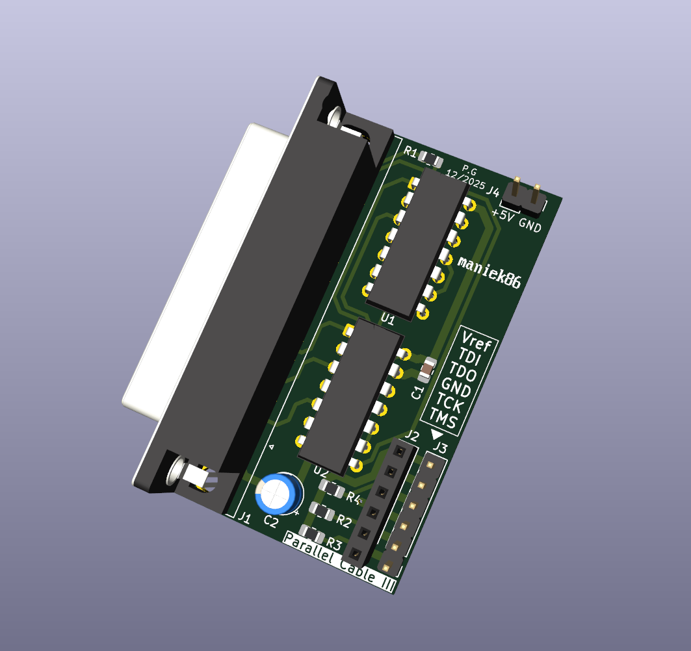
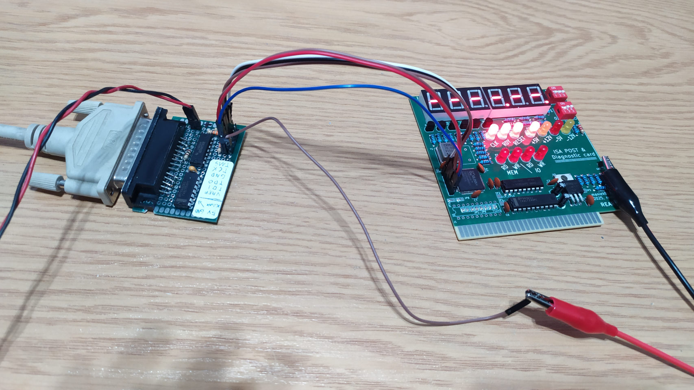
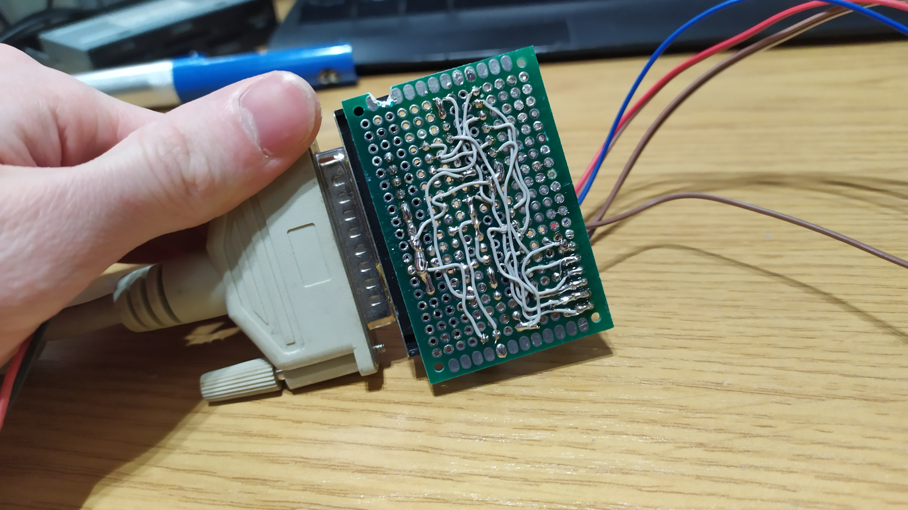

# xilinx_parallel_cable
Another clone of Xilinx parallel cable. The logic is based on what I had in my spare parts at the time of design (7404 + 7405).

## Usage
Connect this device to the PC using a DB-25 cable and provide +5V power to the J4 header, and you're ready to go.

## Pinout
### J4 (74xx logic power)
| Pin | Function  |
|-----|-----------|
| 1   | GND       |
| 2   | +5V       |

### J2 & J3 (connected together)
| Pin | Function  | Note                           |
|-----|-----------|--------------------------------|
| 1   | TMS       |                                |
| 2   | TCK       |                                |
| 3   | GND       |                                |
| 4   | TDO       |                                |
| 5   | TDI       |                                |
| 6   | Vref      | Connect to target device power |

## BOM
| Marking | Value/Element             | Package               | Amount |
|---------|---------------------------|-----------------------|--------|
| C1      | 100n                      | SMD 0805              | 1      |
| C2      | 10u                       | Radial D5.0mm P2.50mm | 1      |
| J1      | DB-25 female connector    |                       | 1      |
| J2      | Pin socket 1x6            | P2.54mm               | 1      |
| J3      | Pin header 1x6            | P2.54mm               | 1      |
| J4      | Pin header 1x2            | P2.54mm               | 1      |
| R1      | 100                       | SMD 0805              | 1      |
| R2-R4   | 470 (330 can be used too) | SMD 0805              | 3      |
| U1      | 7405                      | DIP-14                | 1      | 
| U2      | 7404                      | DIP-14                | 1      |

## Prototype
This design was tested on prototype PCB

